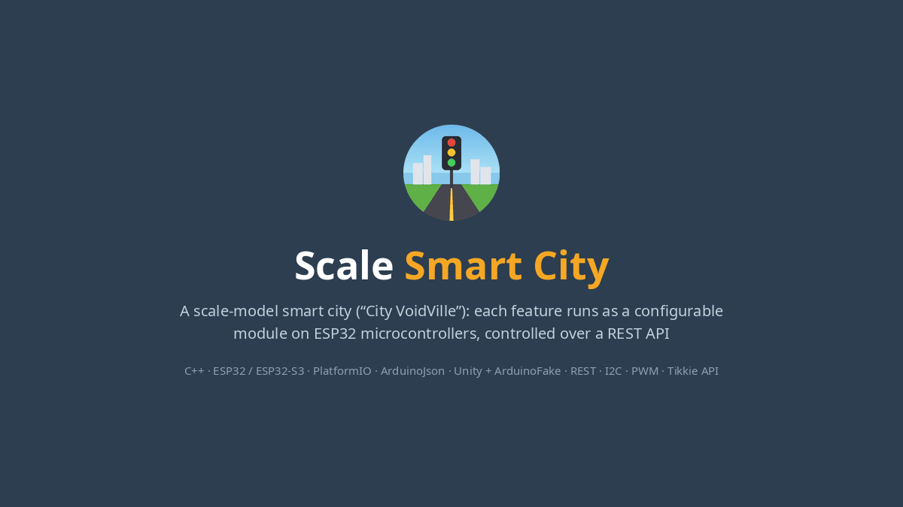
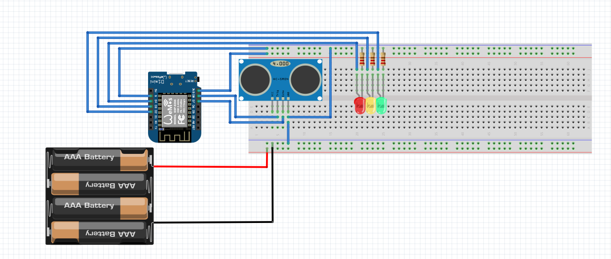

# Scale Smart City

A scale-model smart city ("City VoidVille") built during my study abroad in Amsterdam (HvA, 2026). Each city feature runs as a configurable module on ESP32 microcontrollers, controlled over a REST API and backed by native unit tests.

**Tech:** C++ · ESP32 / ESP32-S3 · PlatformIO · ArduinoJson · Unity + ArduinoFake (native tests) · REST/HTTP · I2C · PWM · ABN AMRO Tikkie API

## Highlights

- **Smart toll gate with real mobile payments.** The gate shows a Tikkie QR code on an OLED screen, polls the Tikkie API until the payment goes through, then opens with a servo. [Demo video](gate/videos/TikkieRealiseVid.mp4)
- **Smart porta-potty.** A laser tripwire detects when someone is inside, and an RGB LED shows vacant, occupied or out of service.
- **Traffic intersection controller.** Runs up to four directional lights, with an emergency flashing mode and ultrasonic car detection at the stop line.
- **Modular firmware framework.** Features are `Module` subclasses created through a factory, configured from JSON and managed with CRUD operations at runtime. Compile flags include only the modules a board needs.
- **Tested without hardware.** Network calls and `millis()` are mocked so payment and gate flows run as native unit tests.

## Projects

### 🚧 Smart Toll Gate (Tikkie payments)
| | |
|---|---|
| **Problem** | Give the city a simple, cashless way to earn money from toll roads |
| **Decision** | Researched credit cards, Tikkie and license-plate recognition (ALPR), and flat-fee, distance-based and subscription pricing. Picked **Tikkie + flat fee** because it is widely used in the Netherlands and is the lowest-risk option |
| **Build** | A `PaymentProcessor` base class with a `TikkiePaymentProcessor` implementation, plus an `IPayable` callback interface. QR codes are drawn on an I2C OLED |
| **Challenges** | The Tikkie URL was too long for a v3 QR code, so I switched to v5. The display redrew too slowly for a phone camera to scan, so I raised the I2C clock to 1 MHz |
| **Docs** | [Analysis](gate/analysis.md) → [Advice](gate/advise.md) → [Design](gate/design.md) → [Realisation](gate/realise.md) |

### 🚻 Smart Porta-Potty
| | |
|---|---|
| **Problem** | People walk to public toilets only to find them occupied or broken |
| **Solution** | A laser + LDR tripwire for occupancy, chosen over PIR and ultrasonic sensors because it suits the model's small scale. An RGB LED shows the state in colours that need no language: green, red, or flashing orange for service |
| **Integration** | Created and controlled through the module API (`setOccupancy`). Its state is exposed over GET for the backend |
| **Docs** | [Analysis](porta-potty/analysis.md) → [Design](porta-potty/design.md) → [Advice](porta-potty/advise.md) |

### 🚦 Intersection Controller
Coordinates the traffic lights at an intersection by axis (N/S, E/W), supports emergency mode and sensor calibration, and reports detected cars upstream. [Docs](modules/intersection-controller.md)

### 🧩 Module Framework & Command API
- `POST /module/{id}/cmd/{cmdName}` sends a JSON command to one module
- `POST /modules/cmds` sends a batch of commands in a single request
- `ModuleContext` handles CRUD for up to 15 modules per board, using a factory pattern and compile-time feature flags (`-DINTERSECTION_CONTROLLER`, `-DENABLE_ALL_MODULES`)

Docs: [Module](modules/module.md) · [Commands](modules/commands.md)

## About this repo
This repo is the documentation and evidence portfolio for my part of the project. Each feature follows an **Analysis → Advice → Design → Realise** cycle and includes circuit diagrams, UML, test results and demo media. The firmware source lives in the team's university GitLab.
