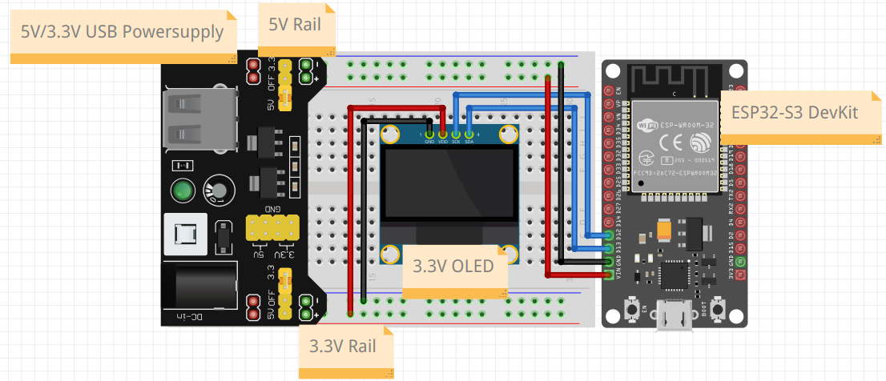
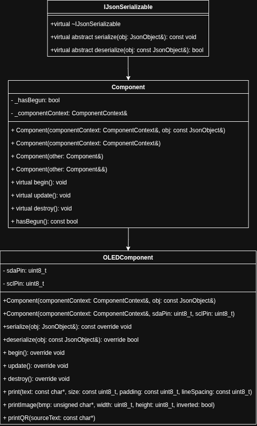
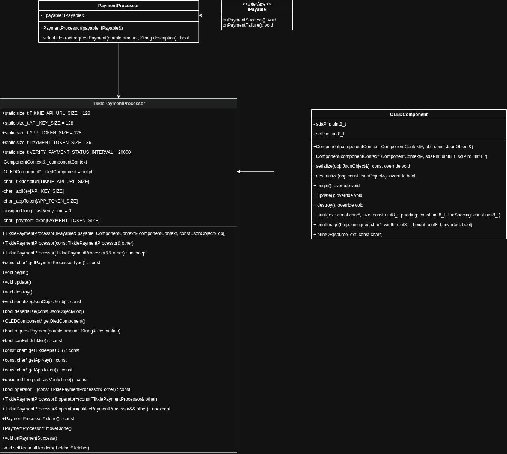
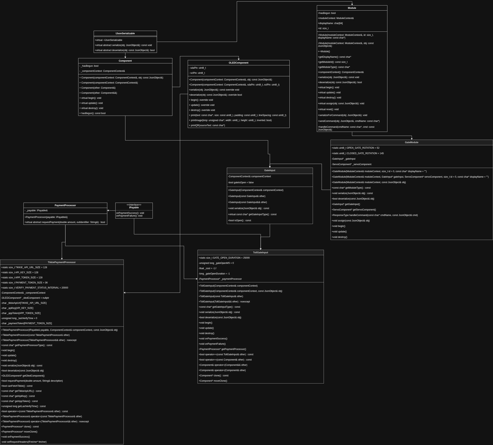

# (Design) Smart Gates Design

> Title: Smart Gates Design <br>
> Date: 2026-05-21
> Author: Clark Miller <br>
> Version: V1 <br>
> Client: Mayor Mats Otten <br>
> Company: City VoidVille <br>

# 1. Table of Contents
- [(Design) Smart Gates Design](#design-smart-gates-design)
- [1. Table of Contents](#1-table-of-contents)
- [2. Introduction](#2-introduction)
  - [2.1 Context](#21-context)
  - [2.2 Target Audience](#22-target-audience)
  - [2.3 Main Question](#23-main-question)
    - [Sub Questions](#sub-questions)
- [3. QR Code User Input](#3-qr-code-user-input)
  - [3.1 Chapter Introduction](#31-chapter-introduction)
  - [3.2 Contents](#32-contents)
  - [3.3 Chapter Conclusion](#33-chapter-conclusion)
- [4. Creating Tikkie Payments with Modules](#4-creating-tikkie-payments-with-modules)
  - [4.1 Chapter Introduction](#41-chapter-introduction)
  - [4.2 Contents](#42-contents)
  - [4.3 Chapter Conclusion](#43-chapter-conclusion)
- [5. Tikkie Payment Status Validation](#5-tikkie-payment-status-validation)
  - [5.1 Chapter Introduction](#51-chapter-introduction)
  - [5.2 Contents](#52-contents)
  - [5.3 Chapter Conclusion](#53-chapter-conclusion)
- [6. Conclusion](#6-conclusion)
- [7. Recommendations](#7-recommendations)
- [8. References](#8-references)

# 2. Introduction
## 2.1 Context

## 2.2 Target Audience
The target audience is any smart-city embedded engineer who needs to implement Tikkie payments into their smart city.

## 2.3 Main Question
How can Tikkie be used as an input? 

### Sub Questions
- How can I use a QR code to get user input?
- How can Modules use Tikkie to create payments?
- How can Modules read their Tikkie payment status?

# 3. QR Code User Input
## 3.1 Chapter Introduction
In this chapter we explore how QR codes can be generated and used as an input for the project.

## 3.2 Contents
Firstly the input type for Tikkie payments in this project is via QR code. This makes use of simple and cheap components and is intuitive to the user.


*Figure 1: Breadboard Circuit Design*

Secondly it uses a simple I2C OLED display. This display should be wired up to the ESP32 as shown in *Figure 1*. The recommended pinout is as seen in *Figure 2*. The SCL/SDA pins should follow what's in the pinout, but if those pins are unavailable most other pins on the ESP32 will work as expected. Note that the OLED Display is powered via 3.3V from the Power Supply and the ESP32 is powered via the 5V rail on the Power Supply.

| Function | Pin | Signal Type | Notes |
| --- | --- | --- | --- |
| OLED GND | GND | Ground | Common ground between ESP32 and display | 
| OLED VDD | 3V3 | Power | 3.3V supply for the OLED display |
| OLED SCK / SCL | GPIO 22 | I2C Clock | Standard ESP32 I2C clock pin |
| OLED SDA | GPIO 21 | I2C Data | Standard ESP32 I2C data pin |
*Figure 2: Pin Mapping for Tikkie Terminal*

Thirdly the expenses of the hardware used is as seen in *Figure 3* which is the bill of materials for the whole project, with aliexpress being the main provider for the components.

| Item | Quantity | Unit Cost(€) | Source
| --- | --- | --- | --- |
| ESP32-S3 development board | 1 | 1.66 | [nl.aliexpress.com][esp32-product-link] |
| I2C OLED display (128x64 or similar) | 1 | 1.04 | [nl.aliexpress.com][oled-product-link] |
| Breadboard | 1 | 0.87 | [nl.aliexpress.com][breadboard-product-link] |
| Jumper wires | 6-8 | 1 | [nl.aliexpress.com][jumper-wires-product-link] |
| USB power source / 5V adapter | 1 | 1 | [nl.aliexpress.com][bread-board-power-supply-product-link] |
| Mobile phone with QR scanner | 1 | Varies | Varies |

*Figure 3: Bill Of Materials*

Fourthly it fits into the design of any other component in the project of being extended from the Component Base Class as seen in *Figure 4*. The utility behind this is that the OLED lifecycle will belong to the ComponentContext class allowing for easy resource sharing. It also brings in some new members for the different pins (sdaPin, sclPin) which are essential for the OLED to connect to the ESP. The OLED is constructed primarily via JSON which mirrors the members of the class as sen in *Figure 5*.

 

*Figure 4: OLEDComponent UML Diagram*

Fifthly the QR code generation logic comes from the header <qrcode.h> as seen in the article by Mdraber. (2024, February 4).

```json
"oled": {
    "sdaPin": 4,
    "sclPin": 5,
    "screenHeight": 64,
    "screenWidth": 128
}
```
*Figure 5: OLED JSON*

## 3.3 Chapter Conclusion

Finally in conclusion, this chapter shows that the QR code is not just a visual output but the main user input mechanism for the payment terminal.

Firstly the Tikkie is utilized via a QR code on an OLED Display.

Secondly the circuit should be build according to *Figure 1* with the pin out being in *Figure 2*.
Thirdly the components are listed in *Figure 3* with their expenses, qty, and sources.

Fourthly the OLEDComponent logic is abstracted and derives from the Component class.

[esp32-product-link]: https://nl.aliexpress.com/item/1005008802548399.html?spm=a2g0o.productlist.main.4.271cDcdVDcdVu0&aem_p4p_detail=202606030402317767525568348040005814400&algo_pvid=1a51191d-c3fb-47c5-85dc-d4dd97279f24&pdp_ext_f=%7B%22order%22%3A%22344%22%2C%22eval%22%3A%221%22%2C%22fromPage%22%3A%22search%22%7D&utparam-url=scene%3Asearch%7Cquery_from%3A%7Cx_object_id%3A1005008802548399%7C_p_origin_prod%3A&search_p4p_id=202606030402317767525568348040005814400_1

[oled-product-link]: https://nl.aliexpress.com/item/1005006206053481.html?spm=a2g0o.productlist.main.34.26d143164316mX&algo_pvid=3a38d8e5-5298-408a-95e8-dc7308cd690b&pdp_ext_f=%7B%22order%22%3A%22928%22%2C%22eval%22%3A%221%22%2C%22fromPage%22%3A%22search%22%7D&utparam-url=scene%3Asearch%7Cquery_from%3A%7Cx_object_id%3A1005006206053481%7C_p_origin_prod%3A

[breadboard-product-link]: https://nl.aliexpress.com/item/1005010426826947.html?spm=a2g0o.productlist.main.19.70606225PmVfO7&algo_pvid=b18b4a14-92b9-43e8-a7a4-e8c8274602af&pdp_ext_f=%7B%22order%22%3A%221103%22%2C%22eval%22%3A%221%22%2C%22fromPage%22%3A%22search%22%7D&utparam-url=scene%3Asearch%7Cquery_from%3A%7Cx_object_id%3A1005010426826947%7C_p_origin_prod%3A

[jumper-wires-product-link]: https://nl.aliexpress.com/item/1005006072348038.html?spm=a2g0o.productlist.main.20.30c657ddafn7or&aem_p4p_detail=2026060304071711274971043983040005449120&algo_pvid=4508b58a-adad-455d-a42b-7e19966e7267&pdp_ext_f=%7B%22order%22%3A%22305%22%2C%22eval%22%3A%221%22%2C%22fromPage%22%3A%22search%22%7D&utparam-url=scene%3Asearch%7Cquery_from%3A%7Cx_object_id%3A1005006072348038%7C_p_origin_prod%3A&search_p4p_id=2026060304071711274971043983040005449120_5

[bread-board-power-supply-product-link]: https://nl.aliexpress.com/item/1005008007831934.html?spm=a2g0o.productlist.main.8.5d411577QP5kwC&aem_p4p_detail=202606030409021292287855964600001390287&algo_pvid=96ec32f4-0cd1-4073-8d77-6f8d65e71178&pdp_ext_f=%7B%22order%22%3A%22416%22%2C%22eval%22%3A%221%22%2C%22fromPage%22%3A%22search%22%7D&utparam-url=scene%3Asearch%7Cquery_from%3A%7Cx_object_id%3A1005008007831934%7C_p_origin_prod%3A&search_p4p_id=202606030409021292287855964600001390287_2

# 4. Creating Tikkie Payments with Modules
## 4.1 Chapter Introduction
In this chapter we learn how Tikkie payments can be created with Modules.

## 4.2 Contents
Firstly, as seen in *Figure 6*, there is a base class called `PaymentProcessor`. This base class declares the virtual method `bool requstPayment(double amount, String description);`. Whenever a part of the program needs to handle payments, it will instantiate a payment processor, store a reference to it, and call the `requestPayment` method.



*Figure 6: Tikkie Payment Creation UML Diagram*

Secondly, a derived class called `TikkiePaymentProcessor` handles the Tikkie-specific logic for creating a payment request. The underlying logic makes an API call to an ABN AMRO Developer Sandbox, which can be set up using the ABN AMRO Tikkie sandbox access guide: https://developer.abnamro.com/api-products/tikkie-v233/reference-documentation#section/Tutorial.

## 4.3 Chapter Conclusion

Finally, in conclusion, creating payments with the system is done through a modular and extensible flow. 

Firstly modules using payments will call the `bool requestPayment(double amount, String description)` to trigger payment creation.

Secondly the payment creation in our case is handled by a derived `PaymentProcessor` class `TikkiePaymentProcessor` which makes API calles as seen in the ABN AMRO guide.

# 5. Tikkie Payment Status Validation
## 5.1 Chapter Introduction
In this chapter we explore how modules can validate the payment status of Tikkie payments.

## 5.2 Contents
Firstly as seen in *Figure 7*, the UML is utilized from the previous chapter but expanded upon with an implementation of the `IPayable` interface `TollGateInput`.



*Figure 7: Full Tikkie UML*

Secondly the implementations for `IPayable` will have their `onPaymentSuccess()` methods called when a payment is validated. These methods will be implemented by the implementations and will process it as an input. `TollGateInput` uses it as the signal to open up the gate.

## 5.3 Chapter Conclusion

Finally, in conclusion, the payment status validation chapter demonstrates how the gate system can 
reliably interpret external payment state.

Firstly the previously seen OLEDComponent is used as seen in *Figure 6*, but expaned on to include our new payment classes.

Secondly once the payment is validated it triggers the `onPaymentSuccess()` method of the `IPayable` implementation.

# 6. Conclusion
This design document demonstrates a coherent path from user input to payment validation for the smart gate system.

Firstly Chapter 3 establishes the user-facing input method: a QR code displayed on an OLED that encodes the Tikkie payment link. That approach matches the project’s need for a low-cost, intuitive interface suitable for embedded hardware.

Secondly Chapter 4 defines the payment creation architecture with a shared `PaymentProcessor` interface and a concrete `TikkiePaymentProcessor`. This separation keeps gateway logic independent of provider-specific API details, making the system extensible and easier to maintain.

Thirdly Chapter 5 explains the payment status validation flow, where `IPayable` implementations poll the `PaymentProcessor` and trigger gate actions when payments complete. This design keeps validation decoupled from gate control while providing a clear, event-driven response to successful payments.

Overall, the document shows that the smart gate can safely integrate Tikkie payments by combining reusable firmware components, a modular payment contract, and a robust status validation mechanism. The result is an embedded system design that supports future payment providers and keeps the user interaction simple.

# 7. Recommendations
I recommend that you do the following to acomplish Tikie Payments within your embedded project.
- Build the circuit as seen.
- Study the full UML diagram.
- Check [Smart Gates Realise](realise.md) for the rest of the implementation details which includes setting up an ABN AMRO Tikkie Sandbox.

# 8. References
Mdraber. (2024, February 4). Generate QR codes with Arduino on OLED display. Hackster.io. https://www.hackster.io/mdraber/generate-qr-codes-with-arduino-on-oled-display-53c074 
ABN AMRO. (n.d.). Tikkie 2.3.3. Tikkie | ABN AMRO | Developer Portal. https://developer.abnamro.com/api-products/tikkie-v233/reference-documentation#tag/Payment-request/operation/createPaymentRequest