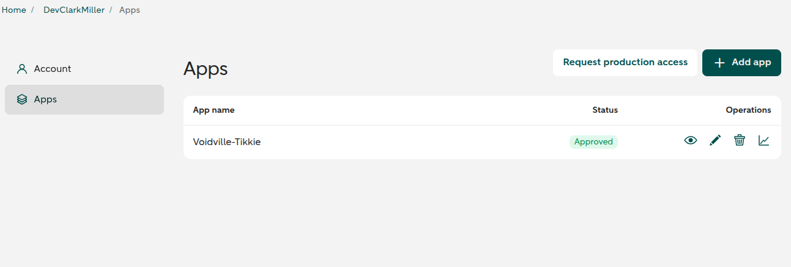
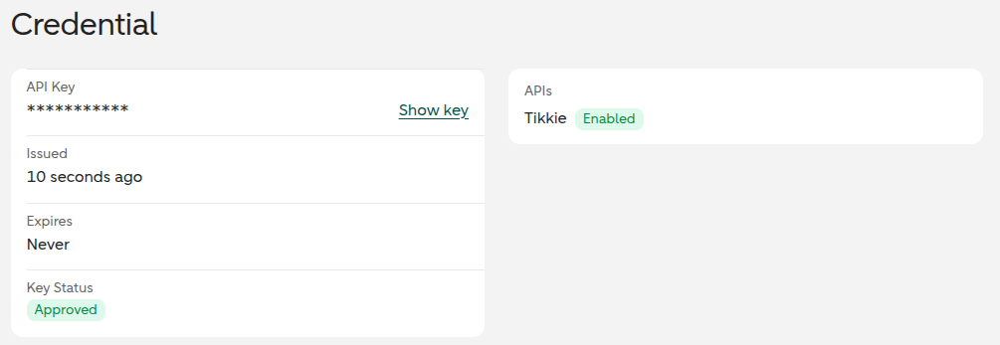
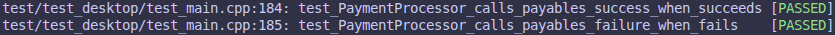
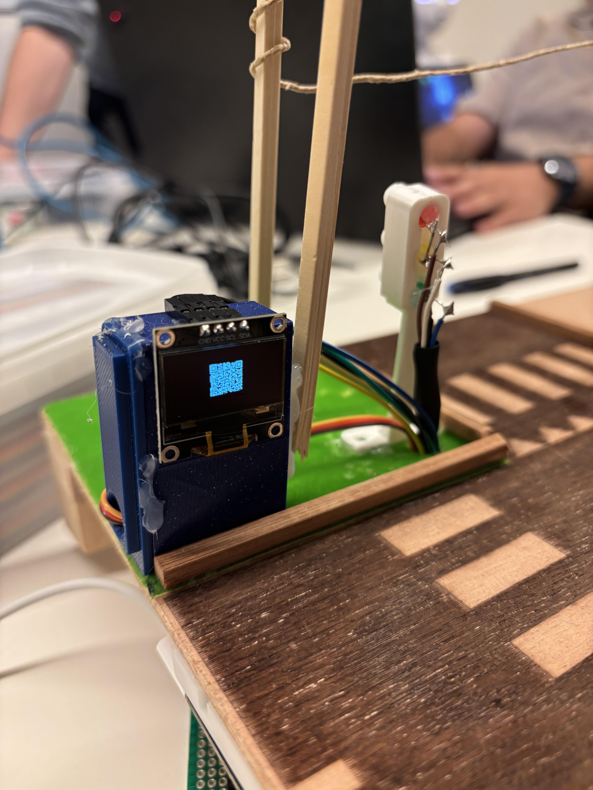
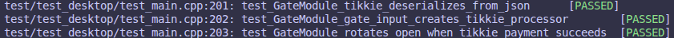

# (Realize) Smart Gates Realise

> Title: Smart Gates Realise <br>
> Date: 2026-05-21
> Author: Clark Miller <br>
> Version: V1 <br>
> Client: Mayor Mats Otten <br>
> Company: City VoidVille <br>

# 1. Table of Contents
- [(Realize) Smart Gates Realise](#realize-smart-gates-realise)
- [1. Table of Contents](#1-table-of-contents)
- [2. Introduction](#2-introduction)
  - [2.1 Context](#21-context)
  - [2.2 Target Audience](#22-target-audience)
  - [2.3 Main Question](#23-main-question)
    - [Sub Questions](#sub-questions)
- [3. Setting Up the Tikkie Sandbox](#3-setting-up-the-tikkie-sandbox)
  - [3.1 Chapter Introduction](#31-chapter-introduction)
  - [3.2 Sandbox Account \& Credentials](#32-sandbox-account--credentials)
  - [3. Chapter Conclusion](#3-chapter-conclusion)
- [4. Creating Tikkie Payments with Modules](#4-creating-tikkie-payments-with-modules)
  - [4.1 Chapter Introduction](#41-chapter-introduction)
  - [4.2 Building the Payment Processor](#42-building-the-payment-processor)
  - [4.3 Chapter Conclusion](#43-chapter-conclusion)
- [5. QR Code User Input](#5-qr-code-user-input)
  - [5.1 Chapter Introduction](#51-chapter-introduction)
  - [5.2 Implementing QR Code Rendering](#52-implementing-qr-code-rendering)
  - [5.3 Chapter Conclusion](#53-chapter-conclusion)
- [6. Tikkie Payment Status Validation](#6-tikkie-payment-status-validation)
  - [6.1 Chapter Introduction](#61-chapter-introduction)
  - [6.2 Implementing Payment Polling](#62-implementing-payment-polling)
  - [6.3 Chapter Conclusion](#63-chapter-conclusion)
- [7. Demonstrating the Working Product](#7-demonstrating-the-working-product)
  - [7.1 Chapter Introduction](#71-chapter-introduction)
  - [7.2 End-to-End Demonstration](#72-end-to-end-demonstration)
  - [7.3 Chapter Conclusion](#73-chapter-conclusion)
- [8. Conclusion](#8-conclusion)
- [9. Recommendations](#9-recommendations)
- [10. References](#10-references)

# 2. Introduction
## 2.1 Context
Smart cities are increasingly moving toward cashless payment systems to handle traffic, reduce congestion, and open up new revenue streams. VoidVille is following this trend by implementing a smart gate toll system as part of its city infrastructure.
To handle payments for this gate, the Tikkie Payment Solution was built. It allows modules to create payment requests and check their status through Tikkie, a Dutch payment platform.
This document shows how that solution was realised. It includes video evidence of the working product, a test overview, and further evidence covering the individual use cases.

## 2.2 Target Audience
The target audience is the City VoidVille smart-city implementation team, embedded engineers, project reviewers and stakeholders who need evidence that the Tikkie Payment Solution works as expected.

## 2.3 Main Question
How can I realise a Tikkie-based smart gate solution and prove it works as a complete product?

### Sub Questions
- How can the Tikkie sandbox be configured for safe development and testing?
- How can a Tikkie payment request be created from a module?
- How can a QR code be used to present a payment request to a user?
- How can a module verify whether a Tikkie payment was completed?
- How can the completed Tikkie gate solution be demonstrated as working through a full product video?

# 3. Setting Up the Tikkie Sandbox
## 3.1 Chapter Introduction
This chapter explains how the Tikkie sandbox was configured for safe development and testing, separate from production payment flows.

## 3.2 Sandbox Account & Credentials
Firstly you must create an ABN AMRO developer account, this is done through [this url](https://developer.abnamro.com/user/register). 

Secondly the Tikkie app must be created for your dev account, this is done through the apps page as seen in *Figure 1*. From there you just click add app, select only "Tikkie" and then give it a name and a description.

  
*Figure 1: Tikkie App Page*

Thirdly once the app is created, you need to copy the api key and generate an app token. The api key can be found under the apps page as seen in *Figure 2* and the app token can be generated with that api key using the curl command seen in *Figure 3*.

  
*Figure 2: Tikkie Get Api Key*

```bash
curl -X POST "https://api-sandbox.abnamro.com/v2/tikkie/sandboxapps" \
-H "API-Key: <YOUR_API_KEY>"
```
*Figure 3: Tikkie App Token Command*

## 3. Chapter Conclusion
This sandbox chapter documents the safe setup used for development and validation.

# 4. Creating Tikkie Payments with Modules
## 4.1 Chapter Introduction
This chapter covers how Tikkie Payments were created with modules and tested.

## 4.2 Building the Payment Processor

Firstly I created the [`PaymentProcessor`][pp-decl] base class along with the [`IPayable`][ip-decl] interface.
However, before an abstract class and an interface can be tested, implementations are needed. So I created [test implementations][pp-decl] for each, allowing me to hardcode the success status as seen through a CTOR in *Figure 4*.

```c++
TestPaymentProcessor(IPayable& payable, bool makeSucceed): 
  PaymentProcessor(payable),
  makeSucceed(makeSucceed)
{}
```
*Figure 4: Hardcoded Success/Fail Case*

Secondly I wrote [some simple tests][test-imps-tests-decl] to check the logic for these test implementations which all run in the native environment since no actual hardware is used. An example of these tests is seen in *Figure 5* with the results seen in *Figure 6*

```c++
void test_PaymentProcessor_calls_payables_success_when_succeeds() {
    TestPayable payable;
    TestPaymentProcessor processor(payable, true);
    
    String identifier;
    String desc;
    processor.requestPayment(0, desc, identifier);
    processor.update();
    TEST_ASSERT_TRUE(payable.success);
}
```
*Figure 5: Test Example*



*Figure 6: PaymentProcessor Test Implements Test Results*

Thirdly I implemented a derived class of PaymentProcessor for Tikkie called [`TikkiePaymentProcessor`][tikkie-payment-decl]. This implementation needed quite a bit of data to work, which I didn't think about when designing it as seen in `Figure 7`. This caused me to have to go back and change my design doc to make sure there wasn't a disconnect with information.

```json
{
  "tikieApiUrl": "string", // The URL to request to when making/validating payments
  "apiKey": "string", // ABN AMRO API Key
  "appToken": "string", // Tikkie APP Token
  "oled": { // The OLED used to display the QR Code 
    "sdaPin": int,
    "sclPin": int,
    "screenHeight": int,
    "screenWidth": int
  }
}
```
*Figure 7: TikkiePaymentProcessor JSON*

Fourthly I made a [series of tests][tikkie-payment-tests-decl] which test for things like constructing the processor from JSON as seen in *Figure 8*, all the way to testing cases where a network error happens or the payment is rejected. Since these tests are ran in the native environment, the hardware logic is mocked. Network request responses are preprogrammed using [`MockerFetcher`][mock-fetcher-decl] and `millis()` calls are coded to return specific values in order which is seen in *Figure 9*

```c++
void test_TikkiePaymentProcessor_ctors_from_json_as_expected() {
    JsonDocument doc;
    JsonObject obj = buildTikkieProcessorJson(doc);

    TikkieTestFacade facade(ResponseType::Ok("We Chillin Villin"), obj);
    OLEDComponent* oled = facade.processor.getOledComponent();

    TEST_ASSERT_NOT_NULL(oled); 
    TEST_ASSERT_EQUAL_INT(TEST_SDA_PIN, oled->getSdaPin());
    TEST_ASSERT_EQUAL_INT(TEST_SCL_PIN, oled->getSclPin());
    TEST_ASSERT_EQUAL_INT(TEST_SCREEN_HEIGHT, oled->getScreenHeight());
    TEST_ASSERT_EQUAL_INT(TEST_SCREEN_WIDTH, oled->getScreenWidth());
}
```
*Figure 8: TikkiePaymentProcessor Deserialization CTOR Test*

```c++
When(Method(ArduinoFake(), millis)).Return(12345678UL, 12345678UL + 5);
```
*Figure 9: Millis Response Programming*

## 4.3 Chapter Conclusion
In conclusion, this chapter covered how Tikkie payments were realised using a modular, layered approach. 
Firstly, a PaymentProcessor base class and IPayable interface were created to keep payment handling generic and reusable. 
Secondly, test implementations of these were written so the core logic could be verified in the native environment, without needing real hardware or a live network. 
Thirdly, TikkiePaymentProcessor was built as a concrete implementation, taking its configuration from a JSON constructor. 
Fourthly, a test suite was written to cover the full range of outcomes: successful payments, network failures, and timeouts by using MockFetcher and scripted millis() values to stand in for the hardware.
The result is a payment component that is both modular and straightforward to test, slots cleanly into the gate module, and handles the asynchronous nature of payment validation in a predictable way.

[pp-decl]: https://gitlab.fdmci.hva.nl/studio/smart-cities/projecten/2025-2026-semester-2/city-sim-learning-group/city-voidville-city-sim-learning-group/-/blob/main/embedded/lib/PaymentProcessor/PaymentProcessor.h?ref_type=heads#L15-28

[ip-decl]: https://gitlab.fdmci.hva.nl/studio/smart-cities/projecten/2025-2026-semester-2/city-sim-learning-group/city-voidville-city-sim-learning-group/-/blob/main/embedded/lib/IPayable/IPayable.h?ref_type=heads#L12-16

[test-imps-decl]: https://gitlab.fdmci.hva.nl/studio/smart-cities/projecten/2025-2026-semester-2/city-sim-learning-group/city-voidville-city-sim-learning-group/-/blob/main/embedded/test/test_desktop/Misc/test_PaymentProccesor.cpp?ref_type=heads#L9-L36

[test-imps-tests-decl]: https://gitlab.fdmci.hva.nl/studio/smart-cities/projecten/2025-2026-semester-2/city-sim-learning-group/city-voidville-city-sim-learning-group/-/blob/main/embedded/test/test_desktop/Misc/test_PaymentProccesor.cpp?ref_type=heads#L38-L58

[tikkie-payment-tests-decl]: https://gitlab.fdmci.hva.nl/studio/smart-cities/projecten/2025-2026-semester-2/city-sim-learning-group/city-voidville-city-sim-learning-group/-/blob/main/embedded/test/test_desktop/Misc/test_PaymentProccesor.cpp?ref_type=heads#L101-163

[mock-fetcher-decl]: https://gitlab.fdmci.hva.nl/studio/smart-cities/projecten/2025-2026-semester-2/city-sim-learning-group/city-voidville-city-sim-learning-group/-/blob/main/embedded/lib/IFetcher/MockFetcher.h?ref_type=heads#L7-45


# 5. QR Code User Input
## 5.1 Chapter Introduction
This chapter describes how QR Code user input was implemented to support Tikkie as a payment method.

## 5.2 Implementing QR Code Rendering

Firstly, the [`OLEDComponent`][oled-component-decl] class was implemented to delegate memory management of the OLED display to the [`ComponentContext`][component-context-decl].

Secondly, the OLED library created by Stefan was extended with a new function, [`void oledQRPrint(Adafruit_SSD1306 *display, const char* sourceText);`][oled-qr-print-decl]. This function is based on the approach described in the article by Mdraber. (2024, February 4).

Thirdly, several issues were encountered during QR code generation. The first was that the version 3 QR code used in the referenced article could not accommodate the full length of the Tikkie API URL. The second was that the rendering speed was too slow for an iPhone camera to scan reliably. Both issues were resolved by switching to a version 5 QR code (also updating the buffer size accordingly, as shown in *Figure 10*) and configuring the I2C clock to 1 MHz for faster OLED updates (as shown in *Figure 11*).

```c++
uint8_t qrcodeData[qrcode_getBufferSize(5)];
qrcode_initText(&qrcode, qrcodeData, 5, 0, sourceText);
```
*Figure 10: Using QR Code Version 5 Instead of Version 3*

```c++
Wire.setClock(1000000UL); // Use 1 MHz I2C for faster OLED updates
```
*Figure 11: Configuring the OLED I2C Clock to 1 MHz*

Fourthly as shown in *Figure 12*, the QR code is successfully rendered on the OLED display and can be scanned to open a Tikkie payment link.

  
*Figure 12: OLED Tikkie QR Code*

## 5.3 Chapter Conclusion
In conclusion, this chapter covered the implementation of QR code rendering on the OLED display. There were two key issues: URL length limitations and slow render speed which were resolved by upgrading to a version 5 QR code and increasing the I2C clock speed. The result is a scannable QR code.

[oled-component-decl]: https://gitlab.fdmci.hva.nl/studio/smart-cities/projecten/2025-2026-semester-2/city-sim-learning-group/city-voidville-city-sim-learning-group/-/blob/main/embedded/lib/OLEDComponent/OLEDComponent.h?ref_type=heads#L13-53

[component-context-decl]: https://gitlab.fdmci.hva.nl/studio/smart-cities/projecten/2025-2026-semester-2/city-sim-learning-group/city-voidville-city-sim-learning-group/-/blob/main/embedded/lib/ComponentContext/ComponentContext.h?ref_type=heads#L14-69

[oled-qr-print-decl]: https://gitlab.fdmci.hva.nl/studio/smart-cities/projecten/2025-2026-semester-2/city-sim-learning-group/city-voidville-city-sim-learning-group/-/blob/main/embedded/lib/OLED/OLED.cpp?ref_type=heads#L84-112


# 6. Tikkie Payment Status Validation
## 6.1 Chapter Introduction
This chapter covers the realisation of the Tikkie Payment Status Validation.

## 6.2 Implementing Payment Polling
Firstly, payment validation is performed on a polling basis, checked every 20 seconds within [update()][tikkie-update-decl] on [TikkiePaymentProcessor][tikkie-payment-decl]. Polling only runs when a payment has actually been requested, reducing unnecessary power consumption on the ESP32 and avoiding rate limiting from ABN AMRO.

Secondly, to validate a payment, a GET request is made to the Tikkie API route [/paymentrequests][tikkie-payment-get-decl] using the token stored after a successful payment request.

Thirdly, upon a successful GET response, the returned JSON string is parsed into a JsonDocument, from which two fields are extracted: "status" and "numberOfPayments".

Fourthly, if the GET request fails, or if the value of "status" is not "OPEN", the payment is considered a failure and PaymentProcessor::onPaymentFailure() is called.
Fifthly, if the GET request succeeds but "numberOfPayments" equals 0, no action is taken and the validation loop continues as normal.

Lastly, if "numberOfPayments" is greater than 0, the payment is considered successful and PaymentProcessor::onPaymentSuccess() is called.

## 6.3 Chapter Conclusion
In conclusion, this chapter covered how Tikkie payments are validated.
Firstly, they are validated on a polling basis.
Secondly GET requests are sent to the Tikkie API using the payment request token.
Thirdly the GET request is parsed and validated.
Fourthly failed GET requests cause an `onPaymentFailure()`.
Lastly the number of payments being greated than 0 triggers `onPaymentSuccess()`.

[tikkie-payment-get-decl]: https://developer.abnamro.com/api-products/tikkie-v233/reference-documentation#tag/Payment-request/operation/getPaymentRequest

[tikkie-payment-decl]: https://gitlab.fdmci.hva.nl/studio/smart-cities/projecten/2025-2026-semester-2/city-sim-learning-group/city-voidville-city-sim-learning-group/-/blob/main/embedded/lib/PaymentProcessor/TikkiePaymentProcessor.h?ref_type=heads#L17-54

[tikkie-update-decl]: https://gitlab.fdmci.hva.nl/studio/smart-cities/projecten/2025-2026-semester-2/city-sim-learning-group/city-voidville-city-sim-learning-group/-/blob/main/embedded/lib/PaymentProcessor/TikkiePaymentProcessor.cpp?ref_type=heads#L88-128

# 7. Demonstrating the Working Product
## 7.1 Chapter Introduction
This chapter documents the full realised product sequence and explains how the recorded video proves the complete gate solution works in practice.

## 7.2 End-to-End Demonstration
Firstly the working product video captures the complete flow from the moment a payment request is created through Tikkie, to the presentation of the QR code, to the final gate opening once payment is confirmed.

Secondly the gate is the physical output of the payment logic, so the demonstration focuses on the end-to-end behaviour rather than only the backend API calls.

Thirdly the video shows the user scanning the QR code, completing the Tikkie payment, and the system detecting the completed payment status.

Fourthly upon successful payment, the [`GateModule`][gate-module-decl] receives the open command and the gate moves as expected.

Fifthly the payment flow has been [tested via unit tests][gate-module-tests-descl] with an example seen in *Figure 13*, the test results seen in *Figure 14* and the video demonstration of it working in *Figure 15*.

```c++
void test_GateModule_rotates_open_when_tikkie_payment_succeeds() {
    ArduinoFakeReset();

    DECL_MOCK_ESSENTIALS()

    std::vector<ResponseType> responses;
    buildTikkieGateResponses(responses, 1, "OPEN");

    MockFetcher fetcher(responses);
    ModuleTestFacade moduleTestFacade(&fetcher);

    JsonDocument doc;
    JsonObject obj = doc.to<JsonObject>();
    buildTikkieTollGateJson(obj);

    GateModuleTestFacade facade(
        moduleTestFacade, 
        new TollGateInput(moduleTestFacade.context.componentContext, obj)
    );

    TollGateInput* gateInput = static_cast<TollGateInput*>(facade.gateInput);
    TikkiePaymentProcessor* processor = static_cast<TikkiePaymentProcessor*>(gateInput->getPaymentProcessor());

    TEST_ASSERT_TRUE(processor->canFetchTikkie());

    facade.gateModule->begin();

    When(Method(ArduinoFake(), millis)).Return(
        0,                                                              // 1. When checking if enough time has passed for the first time
        10UL + TikkiePaymentProcessor::VERIFY_PAYMENT_STATUS_INTERVAL,   // 2. When checking if enough time has passed for the second/final time
        TollGateInput::GATE_OPEN_DURATION,
        TollGateInput::GATE_OPEN_DURATION,
        TollGateInput::GATE_OPEN_DURATION,
        TollGateInput::GATE_OPEN_DURATION
    );
    
    facade.gateModule->update();
    TEST_ASSERT_TRUE(processor->hasRequestedPayment());
    TEST_ASSERT_EQUAL_INT(1, fetcher.postCnt());

    facade.gateModule->update();
    TEST_ASSERT_EQUAL_INT(1, fetcher.getCnt());
    TEST_ASSERT_EQUAL_INT(GateModule::OPEN_GATE_ROTATION, facade.servo.getRotation());
}
```
*Figure 13: Tikkie Gate Unit Test Example.*


*Figure 14: All TikkieGate tests passing for the complete payment and gate actuation flow.*

[Watch the Tikkie demo video](videos/TikkieRealiseVid.mp4)

*Figure 15: Opening Gate Using Tikkie*

## 7.3 Chapter Conclusion
This chapter demonstrates that the realised Tikkie gate solution is both executable and verifiable. The end-to-end video in *Figure 15* shows the live payment-to-gate sequence, while the unit test example in *Figure 13* and the passing test results in *Figure 14* confirm the same logic under controlled verification.

Together, these results show that the system does more than just compile or connect: it actively creates a payment request, displays a QR code, validates the payment, and opens the gate reliably. This combination of recorded evidence and test coverage gives strong confidence that the TikkieGate solution works in practice.

[gate-module-decl]: https://gitlab.fdmci.hva.nl/studio/smart-cities/projecten/2025-2026-semester-2/city-sim-learning-group/city-voidville-city-sim-learning-group/-/blob/main/embedded/lib/GateModule/GateModule.h?ref_type=heads#L15-43

[gate-module-tests-descl]: https://gitlab.fdmci.hva.nl/studio/smart-cities/projecten/2025-2026-semester-2/city-sim-learning-group/city-voidville-city-sim-learning-group/-/blob/main/embedded/test/test_desktop/Modules/GateModule/test_GateModule.cpp?ref_type=heads#L100-195

# 8. Conclusion
This document has shown how the Tikkie Payment Solution was realised as a complete, working smart gate system for the City of VoidVille.

Firstly, the question of how a Tikkie payment request can be created from a module was answered by building a `PaymentProcessor` base class and a concrete `TikkiePaymentProcessor` implementation. The implementation was configured via a JSON constructor and validated through native unit tests using mocked network and hardware dependencies.

Secondly, the question of how a QR code can be used to present a payment request to a user was answered by extending the OLED library with a `oledQRPrint()` function. Switching to a version 5 QR code and setting the I2C clock to 1 MHz resolved the URL length and scan speed issues that came up during implementation, producing a reliably scannable result.

Thirdly, the question of how a module can verify whether a Tikkie payment was completed was answered by implementing a polling mechanism in `TikkiePaymentProcessor` that queries the Tikkie API every 20 seconds, inspects the "status" and "numberOfPayments" fields, and calls the appropriate callback on the result.

Finally, the question of how the completed solution can be demonstrated as a working product was answered through the end-to-end video in Figure 15 of Chapter 7, supported by the passing unit tests in Figure 14, which together confirm the full flow from payment request to gate actuation works as expected.

# 9. Recommendations
I reccommend that the following steps should be taken to perfect the product:

- Instead of the embedded device needing to store Tikkie API information, that logic should be moved to the Backend with the embedded calling the backend instead of Tikkie.

- The 20-second polling interval should be dynamic instead of being a fixed value in order to fine tune in runtime instead of at compile time. A more frequent/infrequent poll might be required in different use cases as well.

- Current the only way to handle payment validation errors is through `onPaymentFailure()`. This should be split up into more methods to handle issues like network failures, timeouts, etc.

- More payment solutions should also be added in. The OLED could be swapped out for a touch screen which gives the options to select payment by clicking buttons on the touch screen.

# 10. References
Miller, C. (2026, May 19). [Smart Gates Design](design.md). City VoidVille.
Mdraber. (2024, February 4). Generate QR codes with Arduino on OLED display. Hackster.io. https://www.hackster.io/mdraber/generate-qr-codes-with-arduino-on-oled-display-53c074 
ABN AMRO. (n.d.). Tikkie 2.3.3. Tikkie | ABN AMRO | Developer Portal. https://developer.abnamro.com/api-products/tikkie-v233/reference-documentation#tag/Payment-request/operation/createPaymentRequest