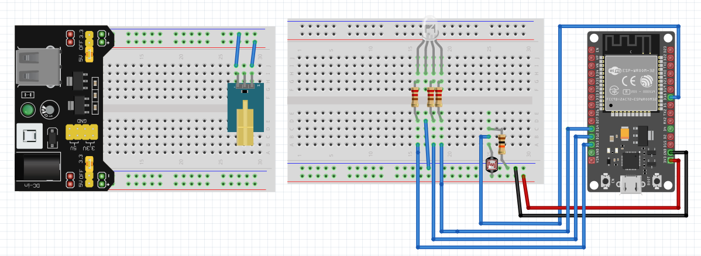
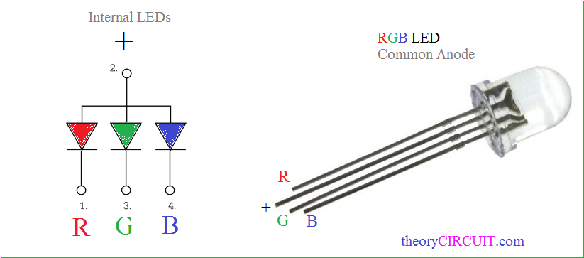

# (Design) Smart Porta-Potty

> Title: Smart Porta Potty Design <br>
> Date: 2026-05-1
> Author: Clark Miller <br>
> Version: V1 <br>
> Client: Mayor Matts Otten <br>
> Company: City VoidVille <br>

# 1. Table of Contents
- [(Design) Smart Porta-Potty](#design-smart-porta-potty)
- [1. Table of Contents](#1-table-of-contents)
- [2. Introduction](#2-introduction)
  - [2.1 Context](#21-context)
  - [2.2 Target Audience](#22-target-audience)
  - [2.3 Main Question](#23-main-question)
    - [Sub Questions](#sub-questions)
- [3. Circuit Breadboard Schematic](#3-circuit-breadboard-schematic)
- [4. Detecting with Laser Tripwire](#4-detecting-with-laser-tripwire)
  - [4.1 Chapter Introduction](#41-chapter-introduction)
  - [4.2 Explanation](#42-explanation)
- [4. Alerting Occupancy with RGB LED](#4-alerting-occupancy-with-rgb-led)
  - [4.1 Chapter Introduction](#41-chapter-introduction-1)
  - [4.2 Explanation](#42-explanation-1)
    - [Pinout and Hardware Setup](#pinout-and-hardware-setup)
- [6. Conclusion](#6-conclusion)
- [7. Recommendations](#7-recommendations)
- [8. References](#8-references)

# 2. Introduction
## 2.1 Context
Public toilets often lack clear indicators of their occupancy status, leading to inconvenience for users. To address this, a smart system is needed to reliably detect and display the status of a porta potty.

## 2.2 Target Audience
This document is for embedded engineers at City VoidVille who will implement the smart porta potty system.

## 2.3 Main Question
How should the laser tripwire be integrated for reliable occupancy detection, and how can the RGB LED be configured to clearly signal each state to users.

### Sub Questions
- How should the laser tripwire be integrated for reliable occupancy detection?
- How can the RGB LED be configured to clearly signal each state to users?

# 3. Circuit Breadboard Schematic
**Figure 3.1: Breadboard Circuit Design**


# 4. Detecting with Laser Tripwire
## 4.1 Chapter Introduction
In this chapter we break down how the laser tripwire mechanic is wired, powered and controlled.

## 4.2 Explanation

Firstly, consider the circuit’s power sources. The breadboard uses two separate supplies: a 5V USB-C power module for the laser emitter (to ensure a strong, stable beam) and the 3.3V from the ESP32 for the rest of the circuit. This separation prevents overloading the ESP32 and ensures reliable operation.

Secondly, assign the correct pins on the ESP32. The LDR voltage divider output connects to an ADC 1 input pin and not the ADC 2 input pin since as stated by (Singh, 2023) "ADC2 pins are tied to the Wi-Fi subsystem's operation, and using them during specific Wi-Fi operations can lead to inaccuracies in ADC readings".

Thirdly, ensure proper alignment and wiring. The laser must be aimed precisely at the LDR, and all connections (including resistors for the LED and voltage divider for the LDR) should be secure and follow the pin mapping table as seen in table figure 3.1.

**Table 3.1: Pin Mapping for Laser Tripwire Detection**
| Function | Pin | Signal Type | Notes |
| --- | --- | --- | --- |
| LDR sensor output | 32 (ADC1) | Analog Input | Reads laser tripwire signal |
| Laser emitter module | 5V rail | Power | Powered from breadboard 5V supply |

Finally in conclusion by following these steps: managing power sources, assigning pins, and ensuring correct alignment and wiring the laser tripwire system can reliably detect occupancy in the porta potty.

# 4. Alerting Occupancy with RGB LED
## 4.1 Chapter Introduction
This chapter explores how the occupancy status is alerted using the RGB LED.


To output the different occupancy states using an RGB LED, a few simple steps were followed. RGB LEDs are ideal for status indication because they can display a wide range of colors using just three pins, making them compact and versatile for embedded projects. This section explains the process, common pitfalls, and practical considerations for using an RGB LED with the ESP32.

## 4.2 Explanation

### Pinout and Hardware Setup
Firstly, I researched the pinout of the RGB LED. There are 4 legs as seen in figure 5.1. 

**Figure 5.1: RGB LED Pinout**

<br><sub>Source: admin. (2017, July 16). Rgb led arduino. theoryCIRCUIT - The Online Community for Electronics and Circuit Design. https://theorycircuit.com/arduino-projects/rgb-led-arduino</sub>

Each leg asides from the negative terminal controls a different colour. Red, Green and Blue.

Secondly, looked into how I could interact with the pins via the ESP32 and I came to a simple conclusion. Each pin should output a 0-255 analog value which is exaclty how RGB is controlled typically and maps to each colour. 

Thirdly, I initially thought to use a library to control the LED, but the simplicity of how it works led me to just create a simple method as seen in code snippet figure 5.2 

**Code Snippet 5.2: C++ setColor function for RGBLED class**
```cpp
void RGBLED::setColor(uint8_t red, uint8_t green, uint8_t blue) {
  analogWrite(_redPin, red);
  analogWrite(_greenPin, green);
  analogWrite(_bluePin, blue);
}
```

and a wrapper class to abstract pin setup and to subscribe to a JSON interface to allow for serialization and deserialization. The exact pins are serialized into JSON as seen in code snippet figure 4.1.

**Code Snippet 5.1: Example JSON configuration for status LED pins**
```json
"statusLED": {
  "redPin": 47,
  "greenPin": 48,
  "bluePin": 45
}
```

Fourthly each leg of the RGB LED gets its own resistor to prevent them from burning out since inside the RGB LED we use is just three LEDs which need resistance of 220 Ω. The exact pins and signal types are as seen in table figure 5.1.

**Table 5.1: Pin Mapping for RGB LED**
| Function              | Pin | Signal Type | Notes                        |
|-----------------------|-----|-------------|------------------------------|
| RGB LED red channel   | 13  | PWM Output  | Through a 220 Ω resistor     |
| RGB LED green channel | 12  | PWM Output  | Through a 220 Ω resistor     |
| RGB LED blue channel  | 14  | PWM Output  | Through a 220 Ω resistor     |

**Placement note:**
Mount the LED where it is clearly visible to users. Avoid direct sunlight or tinted covers that can obscure the color.

Finally in conclusion using an RGB LED for status indication is a cost-effective and flexible solution. Understanding the hardware type (anode/cathode), correct wiring, and PWM logic is essential for accurate color output. Simple code and careful setup ensure reliable, intuitive feedback for users.

# 6. Conclusion

The smart porta-potty used in the document shows a practical, simple and lost-cost solution to the ever present problem of toilets not being as smart as they should be. This is done by combining a laser tripwire with an RGB LED for a realtime display of occupancy.

# 7. Recommendations
I reccomend that you build the breadboard as seen in figure 3.1 and flash the sketch onto an ES32-S3 in order to have a working solution.

# 8. References
Singh, S. (2023, November 30). Why to avoid ESP32 ADC2 pins while using WIFI?. The Electronics. https://www.theelectronics.co.in/2023/11/avoid-using-esp32-adc2-pins-with-wifi.html
admin. (2017, July 16). Rgb led arduino. theoryCIRCUIT - The Online Community for Electronics and Circuit Design. https://theorycircuit.com/arduino-projects/rgb-led-arduino